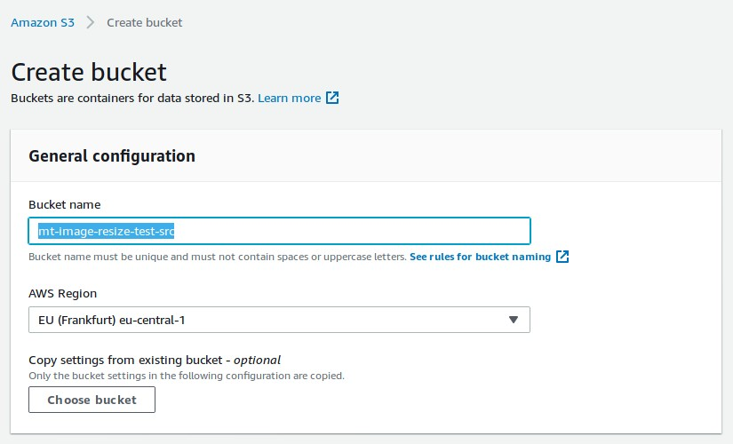
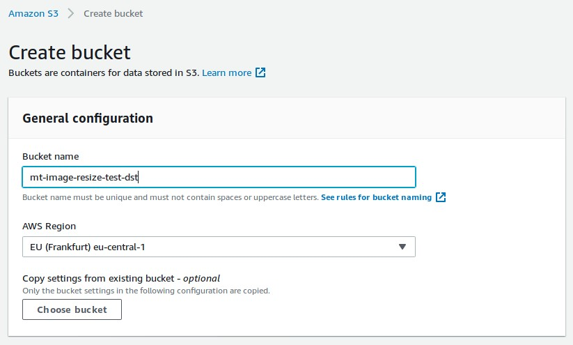
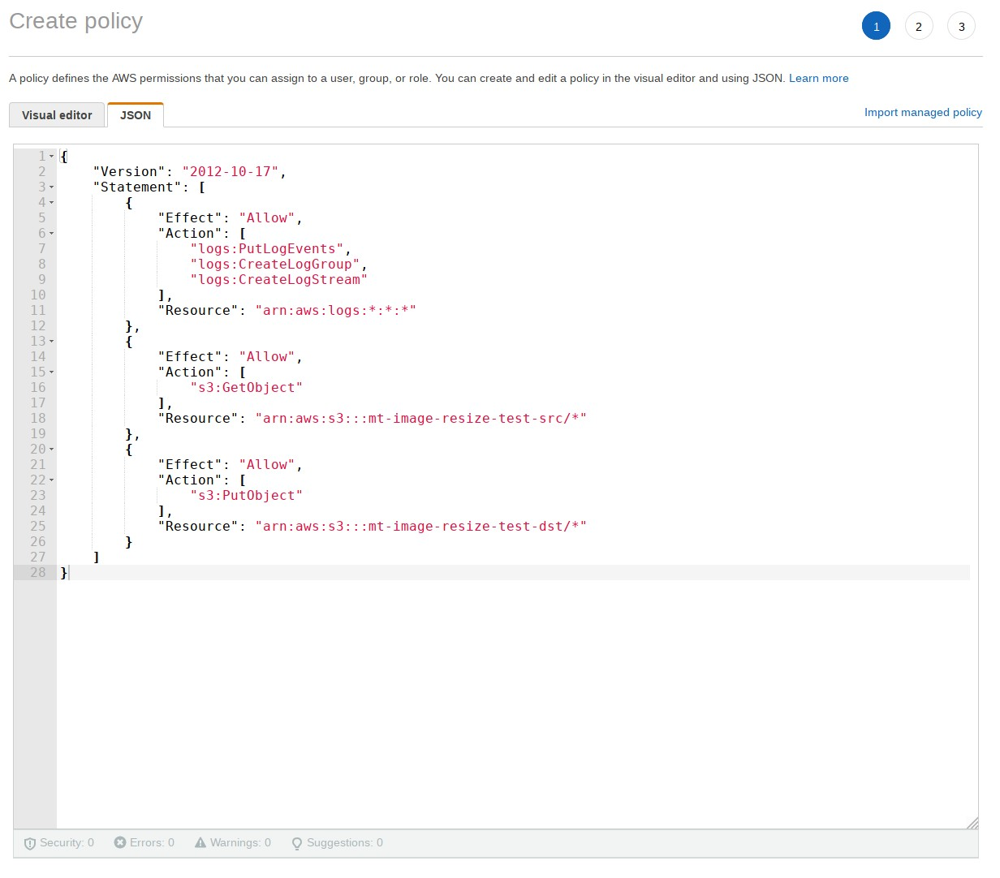
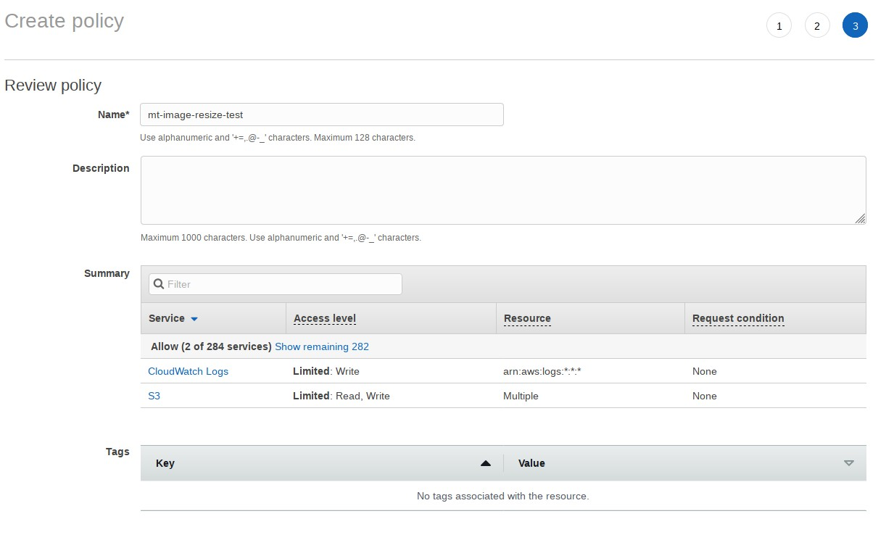
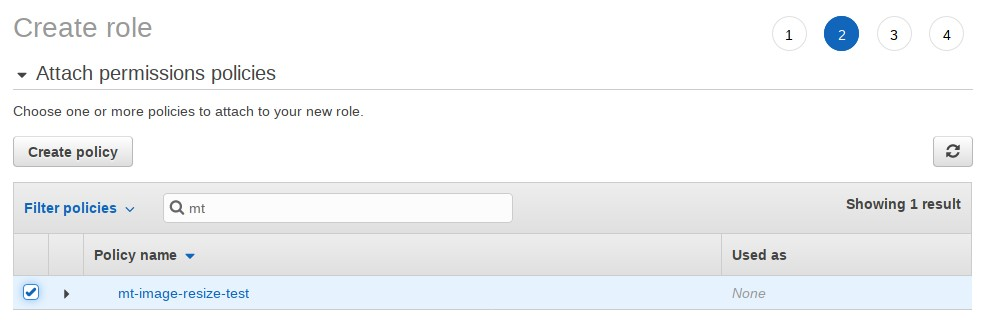
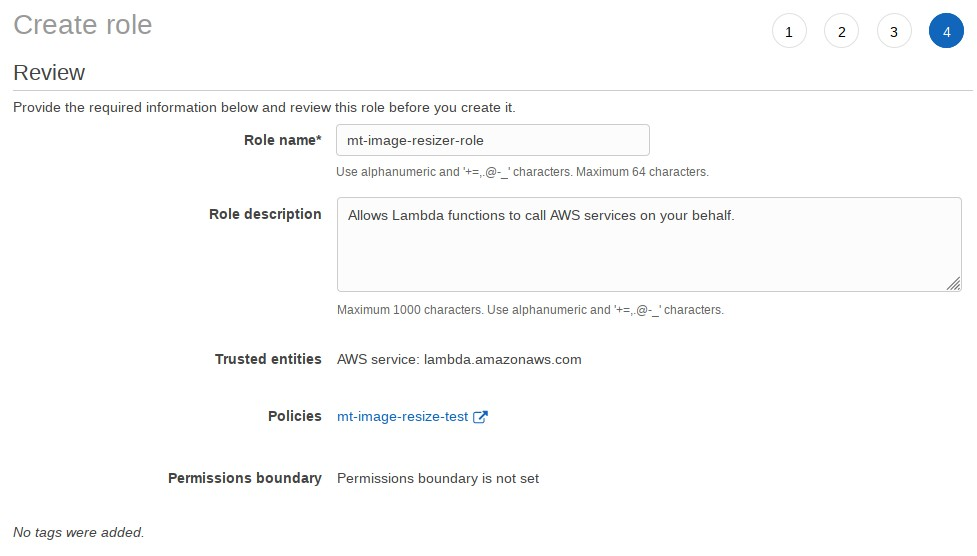
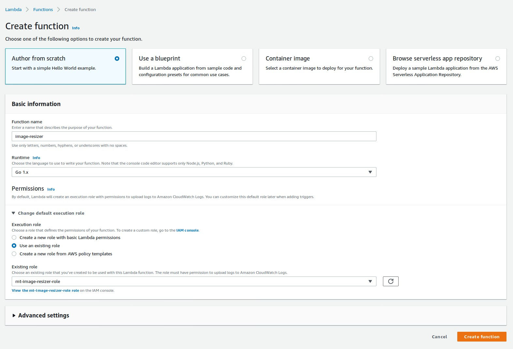

# aws-lambda-image-resizer
AWS Lambda image resizer function written in Go

## Create buckets

Open the S3 management console and create two buckets, one for the source images and one for the resized images:





**Important**: S3 bucket names have to be globally unique!

## Create policy

Open the IAM managment console and create a new policy:






## Create role

Create a new role. For use case, select *Lambda*. Click on next and select the policy from the previous step:





## Build the lambda function

```bash
$ go build resizer.go
$ zip resizer.zip resizer
```
This creates an archive with the resizer binary that can be uploaded as lambda function to AWS.

## Create lambda function

Open the Lambda managment console and create a new function:



This takes some time. After the function is created, the following screen shold be shown:


